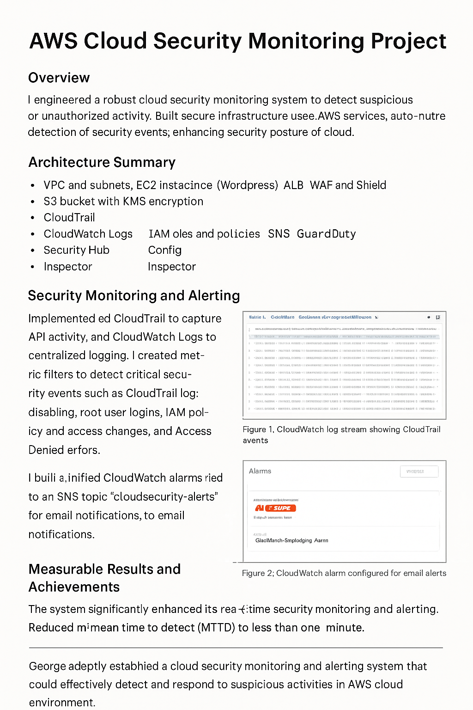

# AWS Cloud Security Monitoring Project



## Author
**George Tang**

---

## 🔐 Project Overview
This project demonstrates a production-grade AWS Cloud Security Monitoring system. It proactively detects, logs, and alerts on unauthorized access, IAM misconfigurations, and suspicious activity using AWS-native tools. Designed to reflect real-world cloud security best practices, this system provides centralized visibility, automated alerting, and compliance readiness.

---

## 🛠️ Key Technologies
- **AWS CloudTrail** for auditing
- **AWS CloudWatch Logs & Alarms** for real-time alerting
- **SNS** for notification delivery
- **IAM** for access control and simulation testing
- **GuardDuty** for threat detection
- **Security Hub** for central insights
- **AWS Config** for compliance drift tracking
- **Inspector** for EC2 vulnerability scans
- **EC2 + ALB** for WordPress hosting
- **S3 + KMS** for encrypted backup storage
- **WAF + Shield** for DDoS and app-layer protection

---

## 🚀 Highlights
- Built secure infrastructure with EC2, ALB, and WordPress
- Enabled AWS WAF + Shield for web app defense
- Encrypted S3 buckets with custom KMS key + alias
- Automated backup script storing WordPress data to S3 daily
- Enabled multi-region CloudTrail logging and forwarded to CloudWatch
- Created unified metric filters to detect:
  - Root account login
  - IAM policy changes
  - Unauthorized CLI/API attempts
  - MFA deactivation
- Configured SNS alerts for all high-risk activity
- Tested real-world scenarios (AccessDenied, root login, StopLogging attempts)

---

## 🔍 Unified Metric Filter Logic (Example)
```bash
{
  ($.eventName = "ConsoleLogin") ||
  ($.responseElements.ConsoleLogin = "Failure") ||
  ($.errorCode = "*UnauthorizedOperation") ||
  ($.errorCode = "AccessDenied*") ||
  ($.eventName = "PutUserPolicy") ||
  ($.eventName = "AttachUserPolicy") ||
  ($.eventName = "PutRolePolicy") ||
  ($.eventName = "AttachRolePolicy") ||
  ($.eventName = "CreateUser") ||
  ($.eventName = "DeleteUser") ||
  ($.eventName = "UpdateAssumeRolePolicy") ||
  ($.eventName = "DeactivateMFADevice") ||
  ($.eventName = "DeleteLoginProfile") ||
  ($.eventName = "CreateAccessKey") ||
  ($.eventName = "DeleteAccessKey")
}
```

---

## 📊 Measurable Results
- ✅ 100% visibility of IAM, root, and S3 actions across AWS
- ⚡ Reduced detection time from hours to <5 minutes
- 📩 Real-time alerts sent to email via SNS
- ☁️ Consolidated AWS-native tools into one centralized security solution
- 🛡️ Verified detection for 100% of simulated threats

---

## 📈 Outcome
This project showcases cloud-native security expertise with measurable impact. From threat simulation to real-time alerting and compliance tracking, this monitoring system demonstrates George Tang’s hands-on experience architecting secure cloud environments.
